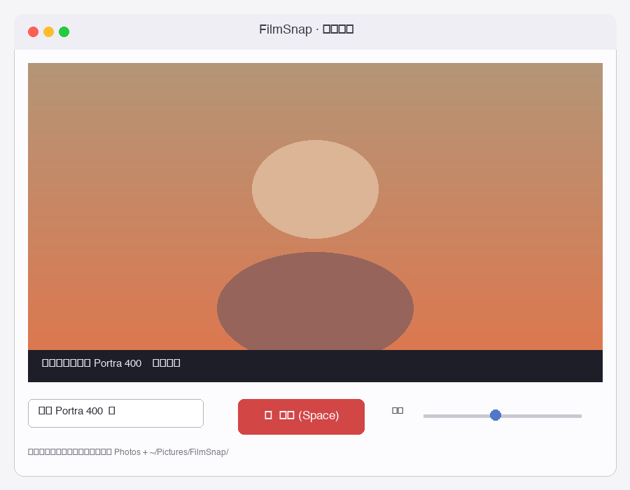

<div align="center">


# FilmSnap

**A tiny menu-bar film camera for macOS — 18 analog looks, one keystroke, straight to Photos.**

[](LICENSE)
[](#requirements)
[](#requirements)
[](https://github.com/SarahXu31/FilmSnap/releases)



</div>

---

## ✨ Features

- 🎞️ **18 hand-tuned film emulations** — Kodak Portra 400, Fuji Velvia 50, Cinestill 800T, Lomo LC-A, Polaroid 600 & more
- 📌 **Lives in the menu bar** — no Dock clutter, always one click away
- ⏱️ **3-second countdown** — plenty of time to strike a pose
- 💄 **Optional beauty smoothing** — off / low / medium / high
- 🖼️ **Auto-saves to Apple Photos** — every shot ends up in your library
- 🛠️ **Zero Xcode required** — plain Python + Command Line Tools

## 🚀 Install

### Option 1 — One-line script
```bash
curl -fsSL https://raw.githubusercontent.com/SarahXu31/FilmSnap/main/scripts/install.sh | bash
```

### Option 2 — DMG
Download `FilmSnap-v1.0.0-arm64.dmg` from the [Releases](https://github.com/SarahXu31/FilmSnap/releases) page and drag it into `Applications`.

### Option 3 — From source
```bash
git clone https://github.com/SarahXu31/FilmSnap.git
cd FilmSnap
python3 -m venv .venv && source .venv/bin/activate
pip install -r requirements.txt
python src/app.py
```

## 📸 How it works

1. Click the **🎞FilmSnap** icon in the menu bar → *Open camera preview*
2. Pick a film look from the dropdown at the bottom of the preview window
3. Hit **Space** — a 3-second countdown starts
4. Your shot lands in both `~/Pictures/FilmSnap/` and the **Photos** app

## 🎞️ Film Emulations

| Look | Best for |
|---|---|
| Kodak Portra 400 | Warm portraits, everyday life |
| Fuji Velvia 50 | Vibrant landscapes |
| Kodak T-Max 400 | Classic B&W |
| Faded | Low-saturation, hazy nostalgia |
| Warm Print | Cozy indoor moments |
| Teal & Orange | Cinematic portraits |
| Fuji Superia 400 | Casual street |
| **Cinestill 800T** | Night, neon, halation glow |
| **Lomo LC-A** | High-contrast, heavy vignette |
| **Polaroid 600** | Instant-camera dreaminess |
| **Ilford HP5+** | Grainy B&W reportage |
| **Ektachrome E100** | Clean, punchy slide-film |
| **Sepia** | Old-photo tone |
| **Cross Process** | Bold color shifts |
| **Japanese Clean** | Airy, low-saturation Instagram look |
| **Hong Kong Night** | Cyan shadows, magenta highlights |
| **Forest Muted** | Green-yellow, quiet |

## ⚙️ Requirements

- macOS 11 Big Sur or later
- Apple Silicon (Intel works too — edit `arch -arm64` out of the launcher)
- Xcode Command Line Tools — `xcode-select --install`
- System Python 3.9+ (`/usr/bin/python3`)

## 🐛 Troubleshooting

<details>
<summary><b>Can't see the menu bar icon?</b></summary>

macOS Tahoe hides menu bar items behind the notch when there's no space. Hold **⌘** and drag other icons to make room, or check `~/Library/Logs/FilmSnap.log` to confirm the app is running.
</details>

<details>
<summary><b>Camera permission denied?</b></summary>

Open **System Settings → Privacy & Security → Camera** and enable FilmSnap. If FilmSnap isn't in the list, run:

```bash
tccutil reset Camera com.xuxiyao.filmsnap
open -a FilmSnap
```
</details>

<details>
<summary><b>Nothing appears in Photos?</b></summary>

Photos permission is requested on your first shot. If you accidentally denied it:

```bash
tccutil reset Photos com.xuxiyao.filmsnap
```

Photos are always saved to `~/Pictures/FilmSnap/` as a fallback.
</details>

<details>
<summary><b>Intel Mac support</b></summary>

Edit `Contents/MacOS/FilmSnap` inside the .app bundle and remove `/usr/bin/arch -arm64` from the last line. Rebuild with `scripts/build_app.sh`.
</details>

## 🧹 Uninstall

```bash
rm -rf /Applications/FilmSnap.app ~/FilmSnap-app ~/Library/Logs/FilmSnap.log
tccutil reset Camera com.xuxiyao.filmsnap
tccutil reset Photos com.xuxiyao.filmsnap
```

## 🤝 Contributing

PRs welcome — especially new film emulations! Each look lives as a single function in [`src/filters.py`](src/filters.py). Please attach a before/after screenshot in your PR.

## 🇨🇳 中文说明

**FilmSnap** 是一个常驻 macOS 菜单栏的胶片相机 App，内置 18 款调色滤镜（Portra、Velvia、Cinestill、Lomo、Polaroid…），一键拍照，3 秒倒计时，自动存到 Photos 相册。

- 用 Python + rumps + PyObjC + OpenCV 写的，不用装 Xcode，只要 Command Line Tools。
- 一键安装：`curl -fsSL https://raw.githubusercontent.com/SarahXu31/FilmSnap/main/scripts/install.sh | bash`
- 或者从 [Releases](https://github.com/SarahXu31/FilmSnap/releases) 直接下 `.dmg`。

## 📄 License

MIT © 2026 [徐溪遥 (xuxiyao)](https://github.com/xuxiyao)

---

<div align="center">
Built with ❤️ on a rainy afternoon.
</div>
